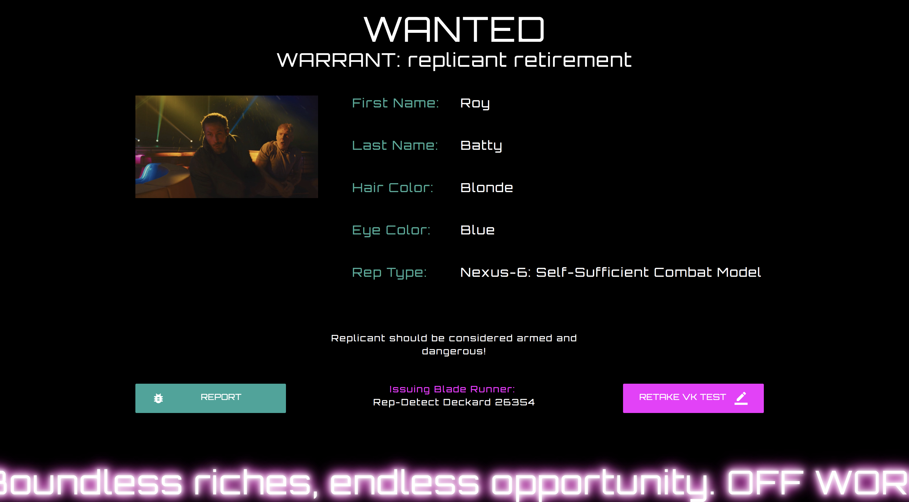

# blade_runner_voight_kampff

> A fun site for those out there who enjoy the 80s sci-fi classic, Blade Runner with Harrison Ford. This site takes you back
(or forward) to Ridley Scott's version of 2019 Los Angeles. A post-apocolyptic time where near humans, called Replicants,
have been outlawed on Earth. The only way to identify them is through a specialized process called a Voight-Kampff test. This
site lets the user experience that for themselves and has a little fun with them at the end:

* Orients the user to the enivronment of the 1982 depiction of 2019 Los Angeles
* Stores standard user information such as name, hair color, eye color, etc.
* Conducts a three question Voight-Kampff test with Harrison Ford leading the way
* Creates a customized "retirement" warrant for the user as they have been identified as a replicant

> [Demo Here](http://bladerunning.surge.sh/)

## Installation

Clone this repository and then simply open `index.html` with your favorite browser!

## Next Steps

- [ ] Apply additional filtering to increase the 80s look and feel
- [ ] Increase the "real" feeling of the VK test and improve audio editing
- [ ] Ability to share wanted poster on social media
